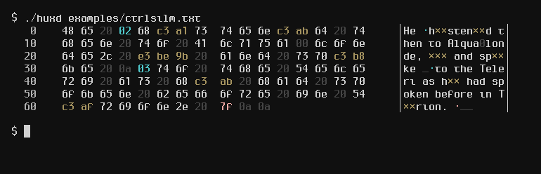
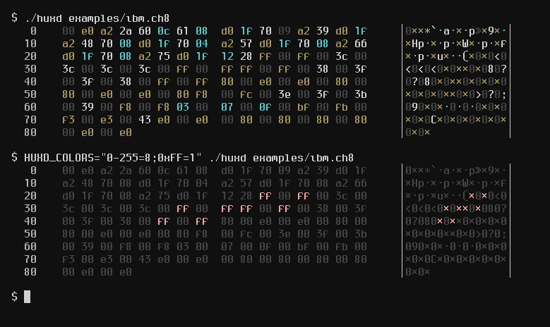
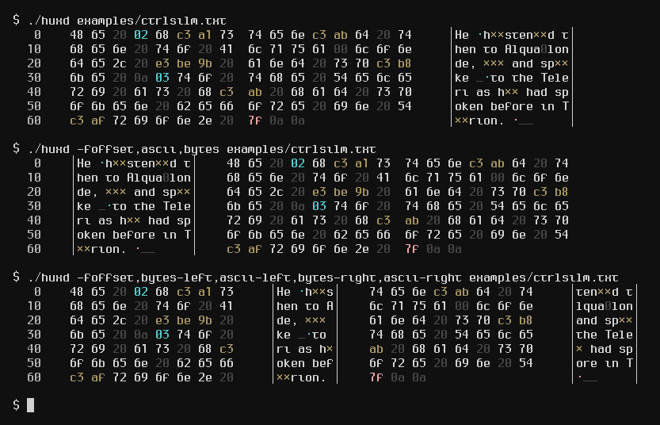

<p align=center>
	
	<h2 align=center>huxdemp (aka <code>huxd</code>)</h2>
</p>

`huxdemp` is an highly advanced version of the venerable `hexdump`.

It uses colors, bolding, and other terminal formatting to distinguish between
`nul` bytes, ASCII whitespace, UTF8-control characters, ASCII control
characters, and normal printable bytes.



Additionally, the colors used can be changed with the `HUXD_COLORS` environment
variable, unlike other hexdumpers. In the screenshot below, all characters
except `0xFF` was set to grey, and `0xFF` was set to red to make it stand out:



`huxdemp` also sports a Lua plugin system, allowing user-defined columns. In the
following screenshot, the builtin `uxn` plugin decodes
[uxn](https://wiki.xxiivv.com/site/uxntal.html) opcodes and displays it
alongside the normal columns:


There's also a neat column reordering feature that can come in handy:



Like @delan's [xd](https://bitbucket.org/delan/xd) hexdumper, `huxdemp` also
sports the ability to print output with the `cp437` codepage, which makes
spotting patterns in binary data much, much easier (see
[here](https://www.azabani.com/2020/11/15/xd.html)):


Finally, `huxdemp` can also highlight bytes that comprise the same Unicode
codepoint:


### Why?

- `huxdemp` has hexdump's `-n` and `-s` flags (many "modern" hexdumpers don't have this!)
- `huxdemp` can "highlight" bytes that "belong" to the same UTF8-encoded character.
- `$HUXD_COLORS` can be set to customize color choices.
- Fully extensible with a Lua plugin system!
- Ability to print characters in IBM's code page 437 (see screenshots).
- Ability to print control characters using fancy Unicode glyphs (e.g. ␀
  for NUL, ␌ for FF (form feed), etc).
- Automatic display through `less(1)` when needed.
- Readable source, written in literate programming using a dialect of `unu`
  from [RetroForth](https://forth.works/).

### Why not?

- No octal or binary view. (This *might* be added later.)
  - Use [hex](https://www.azabani.com/2020/11/15/xd.html) if you want this.
- No "content sqeezing" that replaces lines that are the same as the previous
  lines with an asterisk.
  - Use [hexyl](https://github.com/sharkdp/hexyl) if you want this.
- No pretty line-drawing borders.
  - Use [hexyl](https://github.com/sharkdp/hexyl) if you want this.
- No OpenBSD support. (This will be worked on soon. Patches welcome!)
- Not written in Rust. (The horrors!)
- No Windows support.

### More screenshots

*Reading a snippet from the Silmarillion*:


*Reading `/dev/input/mouse`*:


*Reading part of a PNG image*:


*Reading `/dev/urandom`*:


### Install

#### Requirements

- A POSIX system. (Windows is unsupported at present.)
- For building from source:
  - Lua 5.2 or later.
  - [`scdoc`](https://git.sr.ht/~sircmpwn/scdoc).
  - A C99 compiler and GNU Make.

#### Arch Linux

```
yay huxd
```

#### Download

Download a binary tarball from the releases, unpack, and move the
executable into your $PATH and the manpage (`huxd.1`) to someplace like
`/usr/local/share/man/man1/huxd.1`.

---

#### Building from source

Clone (or download a tarball from the releases), make, and install:

```
$ cd huxdemp
$ make
    CCLD    unu
    UNU     main.c
    CCLD    huxd
    SCDOC   huxd.1
$ sudo make install
[sudo] password for kiedtl:
$
```

### Usage

#### Basic usage

`huxdemp` works like you'd expect:

```
$ ./huxd examples/ibm.ch8
   0    00 e0 a2 2a 60 0c 61 08  d0 1f 70 09 a2 39 d0 1f     │0××*`·a·×·p»×9×·│
  10    a2 48 70 08 d0 1f 70 04  a2 57 d0 1f 70 08 a2 66     │×Hp·×·p·×W×·p·×f│
  20    d0 1f 70 08 a2 75 d0 1f  12 28 ff 00 ff 00 3c 00     │×·p·×u×··(×0×0<0│
  30    3c 00 3c 00 3c 00 ff 00  ff ff 00 ff 00 38 00 3f     │<0<0<0×0××0×080?│
  40    00 3f 00 38 00 ff 00 ff  80 00 e0 00 e0 00 80 00     │0?080×0××0×0×0×0│
  50    80 00 e0 00 e0 00 80 f8  00 fc 00 3e 00 3f 00 3b     │×0×0×0××0×0>0?0;│
  60    00 39 00 f8 00 f8 03 00  07 00 0f 00 bf 00 fb 00     │090×0×·0·0·0×0×0│
  70    f3 00 e3 00 43 e0 00 e0  00 80 00 80 00 80 00 80     │×0×0C×0×0×0×0×0×│
  80    00 e0 00 e0                                          │0×0×            │

$ echo "foo" | ./huxd -
   0    66 6f 6f 0a                                          │foo_            │

$
```

The `-l` flag can be passed to determine how many bytes to display on a single
line:

```
$ ./huxd -l10 examples/ibm.ch8
   0    00 e0 a2 2a 60  0c 61 08 d0 1f     │0××*`·a·×·│
   a    70 09 a2 39 d0  1f a2 48 70 08     │p»×9×·×Hp·│
  14    d0 1f 70 04 a2  57 d0 1f 70 08     │×·p·×W×·p·│
  1e    a2 66 d0 1f 70  08 a2 75 d0 1f     │×f×·p·×u×·│
  28    12 28 ff 00 ff  00 3c 00 3c 00     │·(×0×0<0<0│
  32    3c 00 3c 00 ff  00 ff ff 00 ff     │<0<0×0××0×│
  3c    00 38 00 3f 00  3f 00 38 00 ff     │080?0?080×│
  46    00 ff 80 00 e0  00 e0 00 80 00     │0××0×0×0×0│
  50    80 00 e0 00 e0  00 80 f8 00 fc     │×0×0×0××0×│
  5a    00 3e 00 3f 00  3b 00 39 00 f8     │0>0?0;090×│
  64    00 f8 03 00 07  00 0f 00 bf 00     │0×·0·0·0×0│
  6e    fb 00 f3 00 e3  00 43 e0 00 e0     │×0×0×0C×0×│
  78    00 80 00 80 00  80 00 80 00 e0     │0×0×0×0×0×│
  82    00 e0                              │0×        │

$ ./huxd -l14 examples/ibm.ch8
   0    00 e0 a2 2a 60 0c 61  08 d0 1f 70 09 a2 39     │0××*`·a·×·p»×9│
   e    d0 1f a2 48 70 08 d0  1f 70 04 a2 57 d0 1f     │×·×Hp·×·p·×W×·│
  1c    70 08 a2 66 d0 1f 70  08 a2 75 d0 1f 12 28     │p·×f×·p·×u×··(│
  2a    ff 00 ff 00 3c 00 3c  00 3c 00 3c 00 ff 00     │×0×0<0<0<0<0×0│
  38    ff ff 00 ff 00 38 00  3f 00 3f 00 38 00 ff     │××0×080?0?080×│
  46    00 ff 80 00 e0 00 e0  00 80 00 80 00 e0 00     │0××0×0×0×0×0×0│
  54    e0 00 80 f8 00 fc 00  3e 00 3f 00 3b 00 39     │×0××0×0>0?0;09│
  62    00 f8 00 f8 03 00 07  00 0f 00 bf 00 fb 00     │0×0×·0·0·0×0×0│
  70    f3 00 e3 00 43 e0 00  e0 00 80 00 80 00 80     │×0×0C×0×0×0×0×│
  7e    00 80 00 e0 00 e0                              │0×0×0×        │

$
```

Consult the manpage (`man huxd`) for details on other flags.

#### Custom colors

The `HUXD_COLORS` environment variable is set to change colors. The variable
takes the form of separate statements, separated by `;`'s; each statement sets a
group of characters to a specific color. Each statement takes the following
syntax: `<range>=<color>`.

The color is from 0 to 255, use the following bash script to view all possible
colors:

```
#!/bin/sh
e="$(printf "033")"; t="Lorem 033[1mipsum."
i=0; while [ $i -le 255 ]; do
     printf "${i}$e[4D$e[4C"
     printf "$e[38;5;${i}m $t $e[0m "
     printf "$e[48;5;${i}m$e[30m $t $e[0m "
     printf "$e[48;5;${i}m $t $e[0m "
     printf "$e[48;5;${i}m$e[K$e[mn"
     i=$(( i + 1 ))
done
```

Examples:

```
0=1                  Display NUL in red.
23-25,27,28=34       Display characters 23, 24, 25, 27, and 28 in bright green.
0=1;23-25,27,28=34   Combination of the previous two.
```

Instead of a `<range>`, you can use a predefined range:

|Predefined range | Expanded value |
|:---------------:|:--------------:|
|printable        |      0x20-0x7e |
|unprintable      |  0x0-0x1f,0x7f |
|whitespace       |   0x8-0xd,0x20 |
|blackspace       |      0x08,0x7F |
|nul              |            0x0 |
|del              |           0x7f |

Here's the default value of `HUXD_COLORS`:

```
HUXD_COLORS="printable=15;blackspace=1;nul=8;whitespace=8;128-255=3;1-8=6;11-31=6"
```

#### Using plugins

When using the `-f` flag, `huxdemp` will look for a plugin if the value isn't
one of the builtin columns. For example, with `-f ascii,offset,foo`, `huxdemp`
will use the builtin `ascii`/`offset` columns, and look for a plugin called
`foo` in `$LUA_PATH`. By default that's in the current directory and in obscure
places like `/usr/local/lib/lua5.3/`, but you can set a custom plugin path by
appending the path (say, `$HOME/.config/huxdemp/`) to $LUA_PATH:

```
export LUA_PATH=<my_path>;$LUA_PATH
```

Arguments to `-f` that have a dash in it are treated specially: the part before
the dash is treated as the plugin name, and the bits after as the "sub-plugin".
So `-f foo-bar,foo-baz` will load just the `foo` plugin, and try to run the
`bar()` and `baz()` functions within that plugin's lua script (see the section
below about writing plugins for more info).

#### Writing plugins

Writing a plugin is quite simple: simply create a Lua file `plugin_name.lua`,
and define a `main(buffer, offset, out)` function in the returned module:

```
local M = {}

function M.main(buffer, offset, out)
end

return M
```

For each line, the `main()` function will be called.

* `buffer` is a table of the bytes for that line.
* `offset` is the offset from the start of the file.
* `out` is the stream through which output must be written. *You should print
  output through this stream with `out:write(<args>)`, or your plugin will be
  broken when `less(1)` (with the `-P` flag) is used.*

Here's a simple reimplementation of the `ascii` column, without colors or other
fancy features:

```
-- myascii.lua

local M = {}

function M.main(buffer, offset, out)
    -- Print the beginning border.
    out:write("|")

    -- Iterate over the bytes provided. If it's printable, print it; otherwise,
    -- output a period.
    for i = 1, #buffer do
        if buffer[i] < 32 or buffer[i] > 126 then
            out:write(".")
        else
            out:write(utf8.char(buffer[i]))
        end
    end

    -- Print the end border.
    out:write("|")
end

return M
```

As previously noted, plugins can have multiple columns defined in it -- for
example, the above plugin could have a `M.foo` function defined to define a
`myascii-foo` column which calls `M.foo()`, separate from the default `myascii`
column which calls `M.main()`.

The following APIs are available to plugins (just `require("huxdemp")` to import
them):

* `huxdemp.linewidth() → bool`: Returns the value of the `-l` option.
* `huxdemp.color_for(number) → number`: Returns the color used for a particular
  bytes, taking `$HUXD_COLORS` into account.
* `huxdemp.colors_enabled() → bool`: Returns whether colors are enabled or not
  (with the `-C` flag).

---

### TODO

- Moar plugins! (See: [builtin/README.md](builtin/README.md)).
- Allow plugins to highlight bytes in byte column.
- A flag to "mark" the nth byte of the input, with both an absolute and relative
  position. (Is this really needed?)
  - relative: "huxd -m 0x34,12,0o45 < foo"
  - absolute: "huxd -M 0x34,12,0o45 < foo"
- Support for OpenBSD.
- Use skeeto's branchless utf8 decoder design to make this tool Blazing Fast™.
- Use `pledge(2)`/`unveil(2)` on OpenBSD.
- Support Windows 10/11. (very low priority.)

### License

This project is licensed under the GPLv3 license, with the exception of
`utf8.c`, which comes from [`termbox`](https://github.com/nsf/termbox) and
is licensed under the MIT license.
